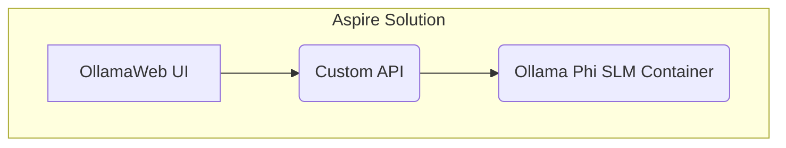

# Aspire.OpenAI

This sample solution demonstrates how to run various resource types in .NET Aspire, including NPM apps, external containers, and REST APIs. This application is related a blog post: https://www.kallemarjokorpi.fi/blog/rag-application-with-net-aspire-and-semantic-kernel/.

> Note!
>
> This sample application was originally created in May 2024. Nowadays, .NET Aspire Community Toolkit provides directly Ollama integration including WebUI: https://learn.microsoft.com/en-us/dotnet/aspire/community-toolkit/ollama?tabs=dotnet-cli%2Cdocker

## .NET Aspire Solution Architecture

## Used technologies

- .NET Aspire 9.1.0
- Semantic Kernel 1.42